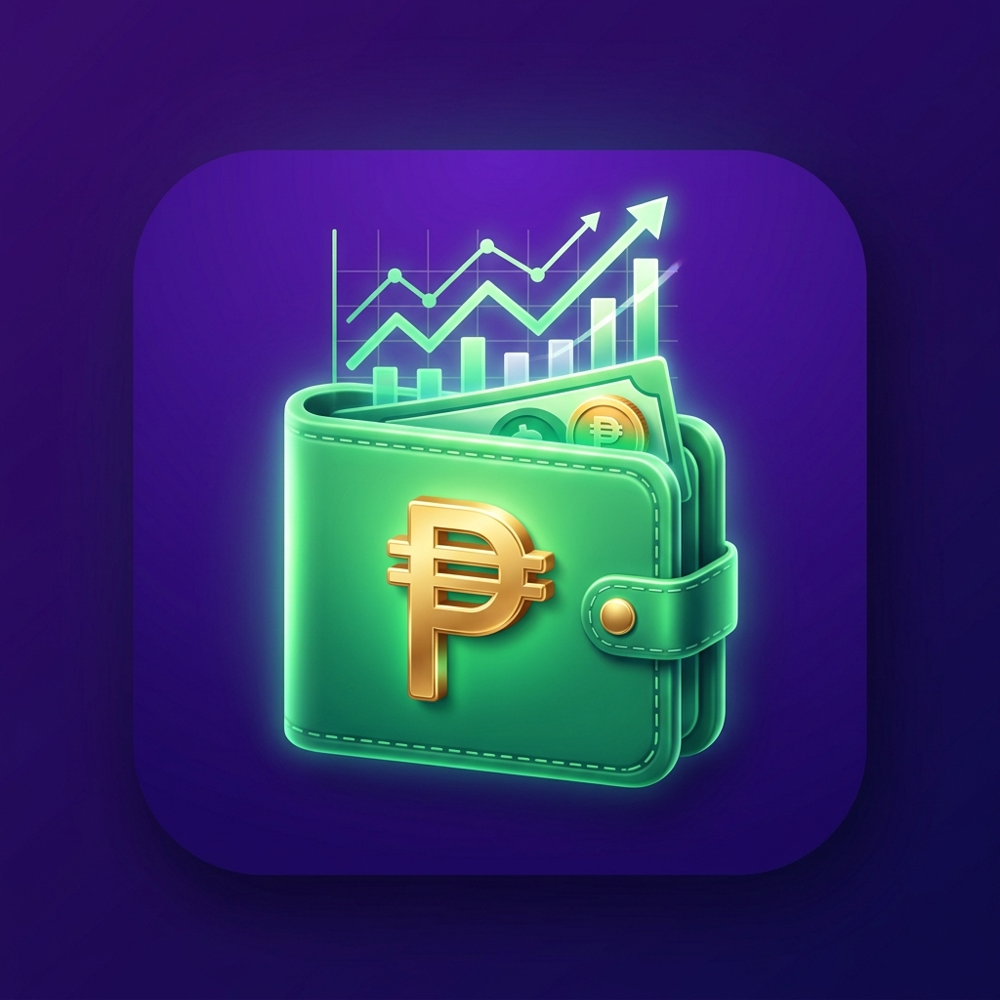

# 💰 Salary Budget Tracker

A modern, sleek, mobile-installable single-page application for tracking your salary, recording expenses, and automatically monitoring your remaining balance in real time.



## 🌟 Key Features

- 💵 **Salary Management**: Input your paycheck / monthly salary (e.g., `₱11,153.80`).
- ➕ **Expense Tracking**: Add expense items with amounts, descriptions, and categories.
- ⚡ **Quick Presets**: 1-tap add chips for common expenses (*Rice, Electricity, Water, Internet, Transpo, Rent*).
- 🏷️ **Categorization**: Tag expenses with icons and emojis (🍚 Food, ⚡ Bills, 🚌 Transport, 🏠 Housing, 🏥 Health, 🛍️ Shopping, 🎮 Entertainment, 💡 Others).
- 📊 **Visual Spent Progress Bar**: Dynamic budget health indicator with green/yellow/red status alerts.
- 📝 **Edit & Delete**: Seamlessly edit expense amounts or descriptions.
- 📱 **Mobile PWA App**: Installable on Android & iOS as a standalone phone app.
- 🌐 **100% Offline Support**: Service worker caches all assets locally on your phone.
- 💾 **Data Auto-Save**: Saves all salary and expense data in `localStorage`.
- 🌙 **Dark & Light Mode**: Built-in theme switcher.
- 📥 **Export Report**: Download budget summaries as CSV files.

---

## 🚀 Quick Start & Running Locally

1. **Clone the repository:**
   ```bash
   git clone https://github.com/EnzoSoti/Buget-Tracking.git
   cd Buget-Tracking/frontend
   ```

2. **Start the local server:**
   ```bash
   npm start
   ```

3. **Open in browser:**
   Go to `http://localhost:5000` (or `http://<your-computer-ip>:5000` from your mobile phone on the same Wi-Fi network).

---

## 📱 How to Install on your Mobile Phone (Android / iOS)

1. Open `http://<your-computer-ip>:5000` on your phone's browser (Chrome or Safari).
2. **Android**: Tap the **3 dots menu (⋮)** in Chrome → Tap **"Add to Home screen"** or **"Install app"**.
3. **iPhone (iOS)**: Tap Safari Share icon (↑) → Tap **"Add to Home Screen"**.
4. The app icon will appear on your phone's home screen and works **100% offline anywhere without internet!**

---

## 🛠️ Built With

- **HTML5 & CSS3**: Vanilla CSS with custom properties, glassmorphism, responsive grid & micro-animations.
- **JavaScript (ES6+)**: Pure JS logic, LocalStorage state management, Intl Peso formatting.
- **PWA Service Worker & Web Manifest**: Native app installation & offline caching.
- **FontAwesome & Google Fonts (Plus Jakarta Sans)**: High quality icons & typography.
